<p align="center">
  
  
  
  
  
  
  
</p>

<h1 align="center">Gojira Vision</h1>
<h3 align="center">Sistem Absensi Karyawan Berbasis Pengenalan Wajah</h3>

<p align="center">
  <i>Absensi cerdas tanpa kartu, tanpa sidik jari — cukup tunjukkan wajahmu.</i>
</p>

---

## Daftar Isi

- [Tentang Proyek](#-tentang-proyek)
- [Screenshot](#-screenshot)
- [Demo Akun](#-demo-akun)
- [Fitur Utama](#-fitur-utama)
- [Tech Stack](#-tech-stack)
- [Arsitektur Sistem](#-arsitektur-sistem)
- [Cara Kerja Face Recognition](#-cara-kerja-face-recognition)
- [Instalasi](#-instalasi)
- [Struktur Database](#-struktur-database)
- [Kelebihan](#-kelebihan)
- [Kekurangan](#-kekurangan)
- [Roadmap](#-roadmap)
- [Struktur Folder](#-struktur-folder)

---

## Tentang Proyek

**Gojira Vision** adalah aplikasi web sistem absensi karyawan yang menggunakan teknologi **pengenalan wajah (face recognition)** berbasis browser. Sistem ini dibangun dengan **Laravel 13** sebagai backend dan **face-api.js** untuk proses deteksi & pengenalan wajah secara real-time melalui webcam.

Tampilan UI menggunakan desain **Neobrutalism** — tebal, bold, dengan hard shadows, border tegas, dan tipografi monospace yang khas. Tersedia tema **Dark** dan **Light** yang bisa di-toggle kapan saja.

Terdapat dua role pengguna:

| Role | Akses |
|------|-------|
| **Admin** | Mengelola karyawan, departemen, jadwal kerja, laporan absensi, export Excel |
| **Karyawan** | Registrasi wajah, clock-in/out dengan verifikasi wajah, lihat riwayat & statistik |

Selain itu, tersedia **Kiosk Mode** — mode terminal publik dengan sistem verifikasi ID karyawan + wajah, dilengkapi window manager bergaya Windows (draggable, resizable, minimize).

---

## Screenshot

### Autentikasi

<table>
  <tr>
    <td align="center"><b>Login</b></td>
    <td align="center"><b>Register</b></td>
  </tr>
  <tr>
    <td>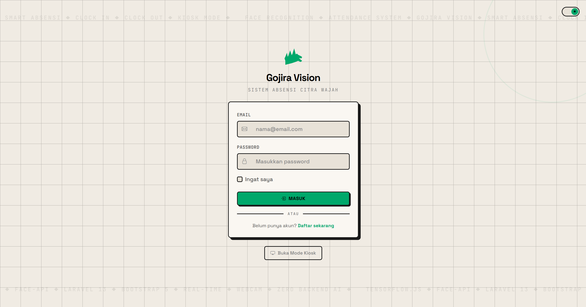</td>
    <td>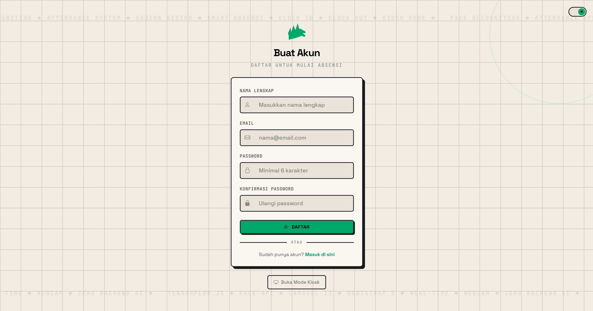</td>
  </tr>
</table>

### Panel Admin

<table>
  <tr>
    <td align="center"><b>Dashboard Admin</b></td>
    <td align="center"><b>Data Karyawan</b></td>
  </tr>
  <tr>
    <td>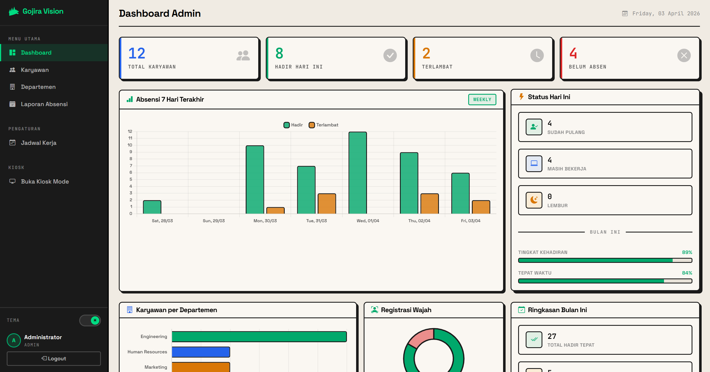</td>
    <td>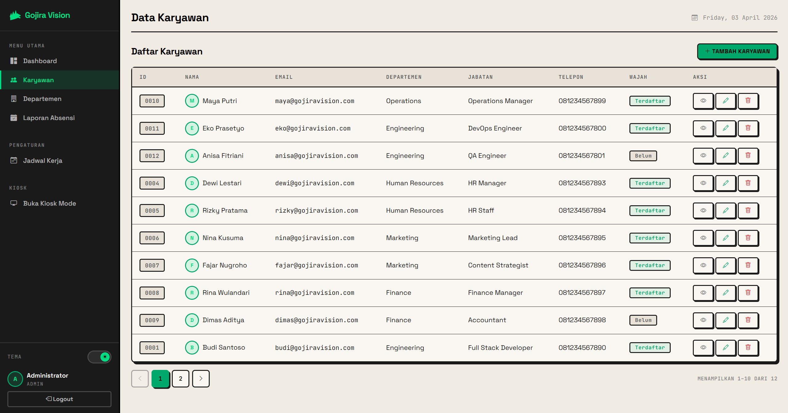</td>
  </tr>
  <tr>
    <td align="center"><b>Departemen</b></td>
    <td align="center"><b>Laporan Absensi</b></td>
  </tr>
  <tr>
    <td>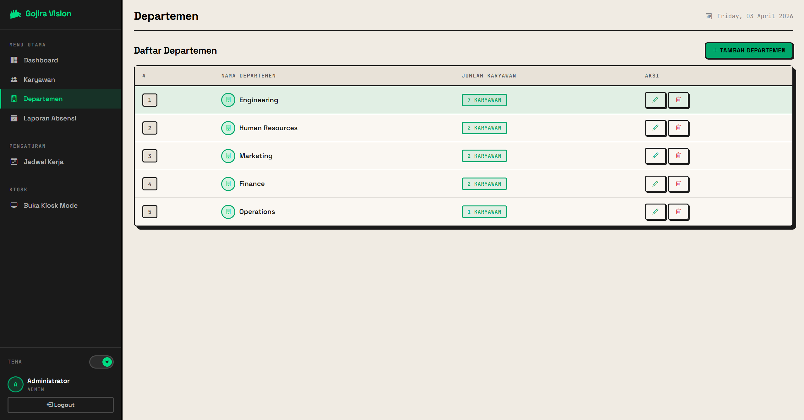</td>
    <td>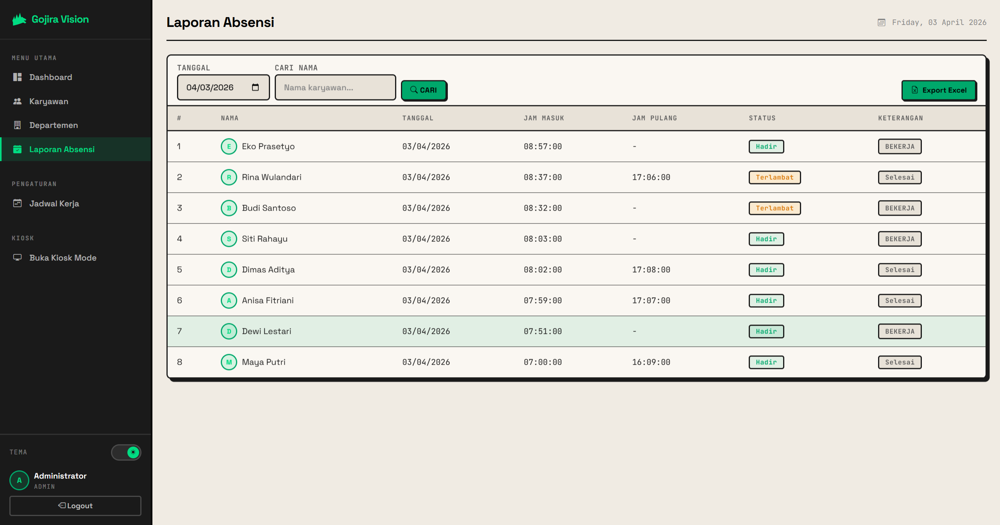</td>
  </tr>
  <tr>
    <td align="center" colspan="2"><b>Jadwal Kerja</b></td>
  </tr>
  <tr>
    <td colspan="2">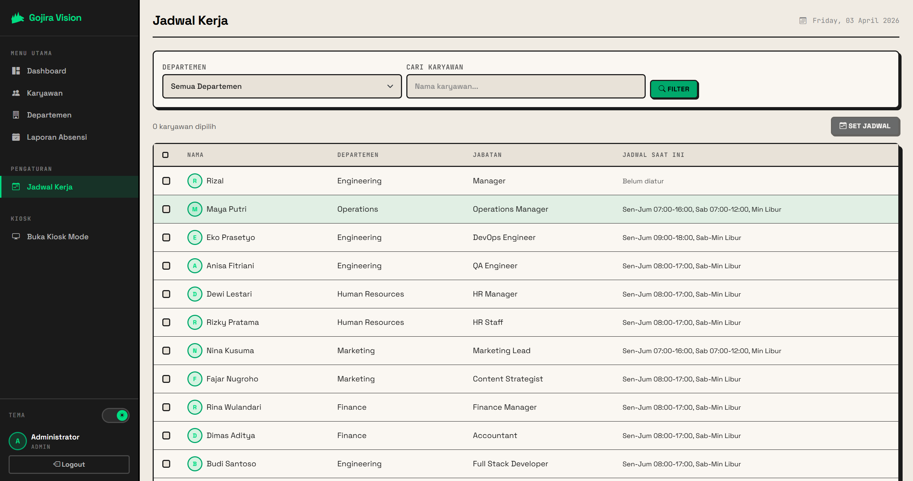</td>
  </tr>
</table>

### Panel Karyawan

<table>
  <tr>
    <td align="center"><b>Dashboard Karyawan</b></td>
    <td align="center"><b>Absensi (Face Verify)</b></td>
  </tr>
  <tr>
    <td>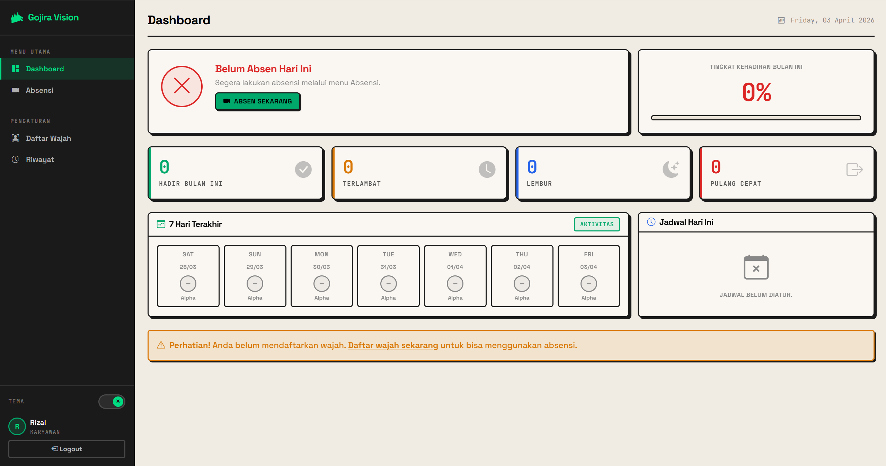</td>
    <td>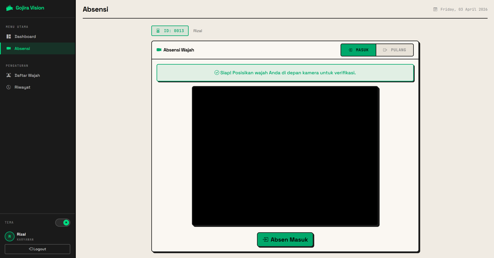</td>
  </tr>
  <tr>
    <td align="center"><b>Daftar Wajah</b></td>
    <td align="center"><b>Riwayat Absensi</b></td>
  </tr>
  <tr>
    <td>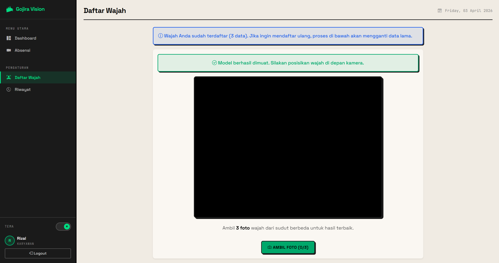</td>
    <td>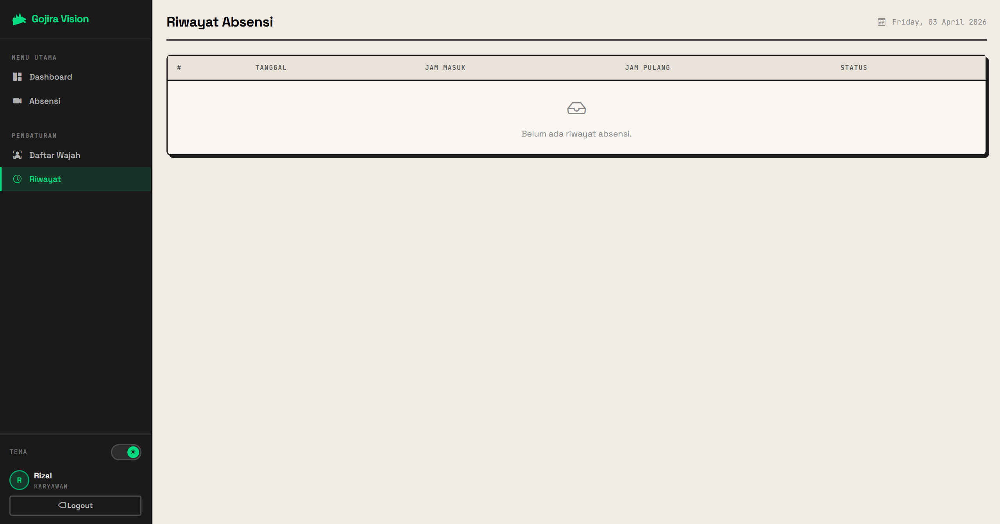</td>
  </tr>
</table>

### Kiosk Mode

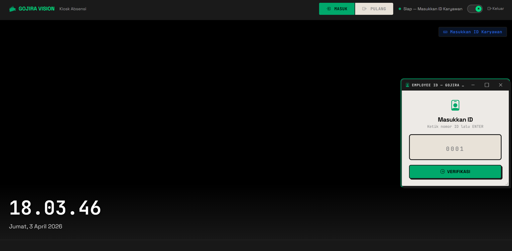

> Kiosk mode dengan window manager bergaya Windows — panel ID bisa di-drag, resize, minimize, dan maximize.

---

## Demo Akun

| Role | Email | Password | Employee ID |
|------|-------|----------|-------------|
| Admin | `admin@gojiravision.com` | `password` | - |
| Karyawan | `budi@gojiravision.com` | `password` | `0001` |
| Karyawan | `siti@gojiravision.com` | `password` | `0002` |

> Jalankan `php artisan migrate:fresh --seed` untuk membuat 1 admin + 12 karyawan dengan data absensi 14 hari.

---

## Fitur Utama

### Untuk Admin

| Fitur | Deskripsi |
|-------|-----------|
| **Dashboard Statistik** | Chart.js: grafik absensi 7 hari (bar chart), registrasi wajah (doughnut), karyawan per departemen (horizontal bar), progress kehadiran & tepat waktu |
| **Kelola Karyawan** | CRUD lengkap dengan Employee ID unik, modal detail face descriptor, pagination neobrutalism |
| **Kelola Departemen** | CRUD departemen dengan counter karyawan per departemen |
| **Jadwal Kerja** | Bulk update jadwal 7 hari untuk banyak karyawan, template cepat (Sen-Jum / Sen-Sab), toggle hari libur |
| **Laporan Absensi** | Filter tanggal & nama, status hadir/terlambat/alpha, keterangan lembur/pulang cepat |
| **Export Excel** | Export laporan absensi ke file Excel (.xlsx) dengan filter yang sedang aktif |

### Untuk Karyawan

| Fitur | Deskripsi |
|-------|-----------|
| **Dashboard** | Status hari ini, tingkat kehadiran bulan ini (%), 4 stat card, timeline 7 hari terakhir, jadwal hari ini |
| **Registrasi Wajah** | Capture 3 foto wajah via webcam untuk generate face descriptor |
| **Absensi Wajah** | Verifikasi wajah hanya terhadap descriptor sendiri (threshold 0.5), toggle masuk/pulang |
| **Riwayat Absensi** | Tabel absensi lengkap dengan pagination, font monospace untuk jam |

### Mode Kiosk

| Fitur | Deskripsi |
|-------|-----------|
| **2-Step Verification** | Masukkan Employee ID dulu, lalu verifikasi wajah — mengurangi false positive |
| **Windows-Style Window** | Panel ID dan verifikasi bisa di-drag, resize, minimize, maximize seperti jendela Windows |
| **Taskbar** | Window yang di-minimize muncul di taskbar bawah, klik untuk restore |
| **3x Consecutive Match** | Butuh 3 deteksi wajah cocok berturut-turut sebelum clock-in/out |
| **Activity Log** | Log aktivitas absensi real-time |
| **Live Clock** | Jam & tanggal digital |
| **Toggle Masuk/Pulang** | Switch mode clock-in atau clock-out |

### Fitur Umum

| Fitur | Deskripsi |
|-------|-----------|
| **Dark / Light Theme** | Toggle tema Neobrutalism gelap/terang, tersimpan di `localStorage` |
| **Auto Status Detection** | Otomatis: `hadir`/`terlambat` saat masuk, `tepat_waktu`/`pulang_cepat`/`lembur` saat pulang |
| **Employee ID System** | Setiap karyawan punya ID 4-digit unik (auto-generate), digunakan untuk verifikasi di kiosk |
| **Role-Based Access** | Middleware memastikan admin & karyawan hanya akses halaman masing-masing |
| **Neobrutalism UI** | Hard shadows, thick borders, Space Grotesk + JetBrains Mono, custom pagination |

---

## Tech Stack

```
+-------------------------------------------------------------+
|                       FRONTEND                              |
|                                                             |
|   Bootstrap 5.3 --- Responsive UI & Components             |
|   face-api.js ------ Face Detection & Recognition (Browser) |
|   Chart.js --------- Dashboard Charts & Statistics          |
|   Vite 8 ----------- Asset Bundling & HMR                  |
|   Sass ------------- CSS Pre-processing                     |
|                                                             |
+-------------------------------------------------------------+
|                       BACKEND                               |
|                                                             |
|   PHP 8.3+ --------- Runtime                                |
|   Laravel 13 ------- Framework                              |
|   Blade ------------ Templating Engine                      |
|   Eloquent ORM ----- Database Abstraction                   |
|   Maatwebsite ------ Excel Export                           |
|                                                             |
+-------------------------------------------------------------+
|                       DATABASE                              |
|                                                             |
|   SQLite ----------- Default (MySQL/PostgreSQL supported)   |
|                                                             |
+-------------------------------------------------------------+
|                     AI / ML (Client-Side)                   |
|                                                             |
|   TinyFaceDetector - Deteksi wajah ringan                   |
|   FaceLandmark68 --- 68 titik landmark wajah                |
|   FaceRecognition -- 128-dim face descriptor vector          |
|   FaceMatcher ------ Pencocokan wajah (threshold: 0.5)      |
|                                                             |
+-------------------------------------------------------------+
```

---

## Arsitektur Sistem

```
+----------+    +--------------+    +-----------------+
|  Browser  |--->|   Webcam API  |--->|  face-api.js    |
| (Client)  |    |  getUserMedia |    |  (TensorFlow)   |
+-----+-----+    +--------------+    +--------+--------+
      |                                        |
      |  1. Input Employee ID                  | Face Descriptor
      |  2. HTTP POST (clock-in/out)           | (128-dim vector)
      v                                        v
+-------------------------------------------------------------+
|                    Laravel Backend                           |
|                                                             |
|  +-----------+  +------------+  +-------------------+       |
|  |  Routes    |->| Controllers |->|     Models        |       |
|  | (web.php)  |  |            |  |  (Eloquent ORM)   |       |
|  +-----------+  +------------+  +---------+---------+       |
|                                            |                |
|  +-----------+  +------------+             |                |
|  | Middleware  |  |   Views    |             |                |
|  | (RoleCheck) |  |  (Blade)   |             |                |
|  +-----------+  +------------+             |                |
|                                            v                |
|                                  +------------------+       |
|                                  | SQLite Database   |       |
|                                  +------------------+       |
+-------------------------------------------------------------+
```

---

## Cara Kerja Face Recognition

### 1. Registrasi Wajah

```
Karyawan membuka halaman "Daftar Wajah"
        |
        v
Webcam aktif --> Capture 3 foto wajah dari sudut berbeda
        |
        v
face-api.js extract 128-dim descriptor per foto
        |
        v
POST ke server --> Simpan 3 descriptor di tabel face_descriptors
```

### 2. Absensi via Akun (Mode Login)

```
Karyawan buka halaman "Absensi"
        |
        v
Fetch HANYA face descriptors milik user yang login
        |
        v
Buat FaceMatcher (threshold 0.5, single-employee)
        |
        v
Deteksi wajah dari webcam --> Cocokkan
        |
        +-- Match --> Tombol "Absen Masuk/Pulang" aktif
        |
        +-- No Match --> "Wajah tidak cocok"
```

### 3. Mode Kiosk (2-Step Verification)

```
Terminal publik menjalankan halaman kiosk
        |
        v
Step 1: Karyawan input Employee ID (e.g. "0001")
        |
        v
API Lookup --> Ambil nama + face descriptors karyawan tersebut
        |
        v
Step 2: Verifikasi wajah (hanya cocokkan dengan 1 orang)
        |
        v
3x consecutive match --> Auto clock-in / clock-out
        |
        v
Kembali ke Step 1 (siap untuk karyawan berikutnya)
```

---

## Instalasi

### Prasyarat

- PHP >= 8.3
- Composer
- Node.js >= 18
- npm

### Langkah-langkah

```bash
# 1. Clone repository
git clone https://github.com/username/gojira-vision.git
cd gojira-vision

# 2. Install dependencies
composer install
npm install

# 3. Setup environment
cp .env.example .env
php artisan key:generate

# 4. Buat database SQLite
touch database/database.sqlite

# 5. Jalankan migrasi & seeder (1 admin + 12 karyawan + 14 hari absensi)
php artisan migrate:fresh --seed

# 6. Build frontend assets
npm run build
# atau untuk development:
npm run dev

# 7. Jalankan server
php artisan serve
```

Buka `http://localhost:8000` dan login dengan akun demo.

---

## Struktur Database

```
+-------------------+       +--------------------+
|   departments     |       |   work_schedules   |
|-------------------|       |--------------------|
| id                |       | id                 |
| name (unique)     |       | user_id (FK)       |
+--------+----------+       | day_of_week (1-7)  |
         |                  | clock_in_time      |
         | 1:N              | clock_out_time     |
         |                  | is_day_off         |
         v                  +--------+-----------+
+-------------------+                |
|     users         |<---------------+
|-------------------|         N:1
| id                |
| employee_id       |       +--------------------+
| name              |       | face_descriptors   |
| email             |       |--------------------|
| password          |------>| id                 |
| role (enum)       |  1:N  | user_id (FK)       |
| position          |       | descriptor (JSON)  |
| phone             |       | label              |
| face_registered   |       +--------------------+
| department_id     |
+--------+----------+
         |
         | 1:N
         v
+-------------------+
|   attendances     |
|-------------------|
| id                |
| user_id (FK)      |
| date              |
| clock_in          |
| clock_out         |
| status            |  <-- hadir / terlambat / alpha
| clock_out_status  |  <-- tepat_waktu / pulang_cepat / lembur
| note              |
+-------------------+
```

---

## Kelebihan

| # | Kelebihan | Penjelasan |
|---|-----------|------------|
| 1 | **Contactless & Hygienic** | Tidak perlu sentuh perangkat apapun — cukup wajah di depan webcam |
| 2 | **Anti-Titip Absen** | Face verification memastikan yang absen benar-benar orangnya |
| 3 | **Zero Hardware Cost (AI)** | Face recognition berjalan di browser — tidak butuh server GPU atau API berbayar |
| 4 | **Employee ID + Face Verification** | 2-step verification di kiosk mengurangi false positive secara drastis |
| 5 | **Kiosk Mode** | Terminal publik dengan window manager bergaya Windows — modern dan interaktif |
| 6 | **Dashboard Analytics** | Chart.js untuk visualisasi data absensi, departemen, dan registrasi wajah |
| 7 | **Auto Status Detection** | Otomatis menentukan terlambat/tepat waktu/lembur berdasarkan jadwal kerja |
| 8 | **Export Excel** | Laporan absensi bisa di-export ke Excel dengan filter |
| 9 | **Flexible Scheduling** | Jadwal kerja per karyawan per hari — bisa atur shift berbeda |
| 10 | **Dark & Light Theme** | UI Neobrutalism dengan dua tema yang bisa di-toggle |
| 11 | **Ringan & Portabel** | SQLite sebagai default — tidak perlu install database server |
| 12 | **Neobrutalism UI** | Desain modern: hard shadows, thick borders, monospace typography |

---

## Kekurangan

| # | Kekurangan | Penjelasan |
|---|------------|------------|
| 1 | **Client-Side Processing** | Semua proses AI berjalan di browser — performa tergantung spesifikasi device |
| 2 | **Tidak Ada Liveness Detection** | Belum ada deteksi apakah wajah "hidup" atau hanya foto — rentan spoofing |
| 3 | **Butuh Koneksi Internet** | Model face-api.js dimuat dari CDN — tanpa internet, face recognition tidak berjalan |
| 4 | **Kiosk Tanpa Auth** | Kiosk mode bersifat public endpoint — perlu diamankan di jaringan lokal |
| 5 | **Skalabilitas Terbatas** | SQLite kurang optimal untuk ratusan karyawan concurrent |
| 6 | **Tidak Ada Notifikasi** | Belum ada notifikasi email/push saat karyawan terlambat |
| 7 | **Single Location** | Belum mendukung multi-kantor atau multi-lokasi |
| 8 | **Tidak Ada API Mobile** | Belum ada REST API untuk aplikasi mobile |
| 9 | **Akurasi Bergantung Kondisi** | Pencahayaan buruk atau perubahan penampilan bisa menurunkan akurasi |

---

## Roadmap

- [x] Dashboard dengan statistik dan chart
- [x] Employee ID system (2-step kiosk verification)
- [x] Export laporan ke Excel
- [x] Neobrutalism UI design
- [x] Windows-style window manager di kiosk
- [x] Custom pagination
- [ ] Liveness Detection (anti-spoofing)
- [ ] Notifikasi email untuk keterlambatan
- [ ] REST API untuk mobile app
- [ ] Multi-lokasi & multi-timezone
- [ ] Self-hosted face-api.js models (offline support)
- [ ] Integrasi dengan Google Calendar / Slack

---

## Struktur Folder

```
gojira-vision/
├── app/
│   ├── Exports/                       # Excel export class
│   ├── Http/
│   │   ├── Controllers/
│   │   │   ├── Admin/                 # Dashboard, Employee, Department, Schedule, Report
│   │   │   ├── AuthController         # Login, Register
│   │   │   ├── AttendanceController
│   │   │   ├── FaceRegistrationController
│   │   │   ├── KaryawanController
│   │   │   └── KioskController        # Kiosk mode + ID lookup
│   │   └── Middleware/
│   │       └── RoleMiddleware
│   └── Models/                        # User, Attendance, FaceDescriptor, Department, WorkSchedule
├── database/
│   ├── migrations/                    # 10 migration files
│   └── seeders/
│       └── DatabaseSeeder             # 5 departments, 13 users, schedules, 14 days attendance
├── resources/
│   ├── css/app.css                    # 1100+ lines Neobrutalism dark/light theme
│   ├── js/app.js
│   └── views/
│       ├── layouts/app.blade.php      # Main layout (sticky sidebar)
│       ├── auth/                      # login, register
│       ├── admin/                     # dashboard, employees, departments, attendances, schedules
│       ├── karyawan/                  # dashboard, attendance, face-register, history
│       ├── kiosk.blade.php            # Full-screen kiosk with Windows-style windows
│       └── vendor/pagination/         # Custom neobrutalism pagination
├── screenshots/                       # Screenshot antarmuka
├── routes/
│   └── web.php
├── .env.example
├── composer.json
├── package.json
└── vite.config.js
```

---

<p align="center">
  <b>Gojira Vision</b> — Smart Attendance, Zero Touch.
  <br/>
  <sub>Built with Laravel 13 & face-api.js | Neobrutalism UI Design</sub>
</p>
